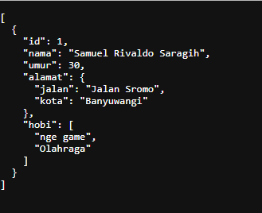
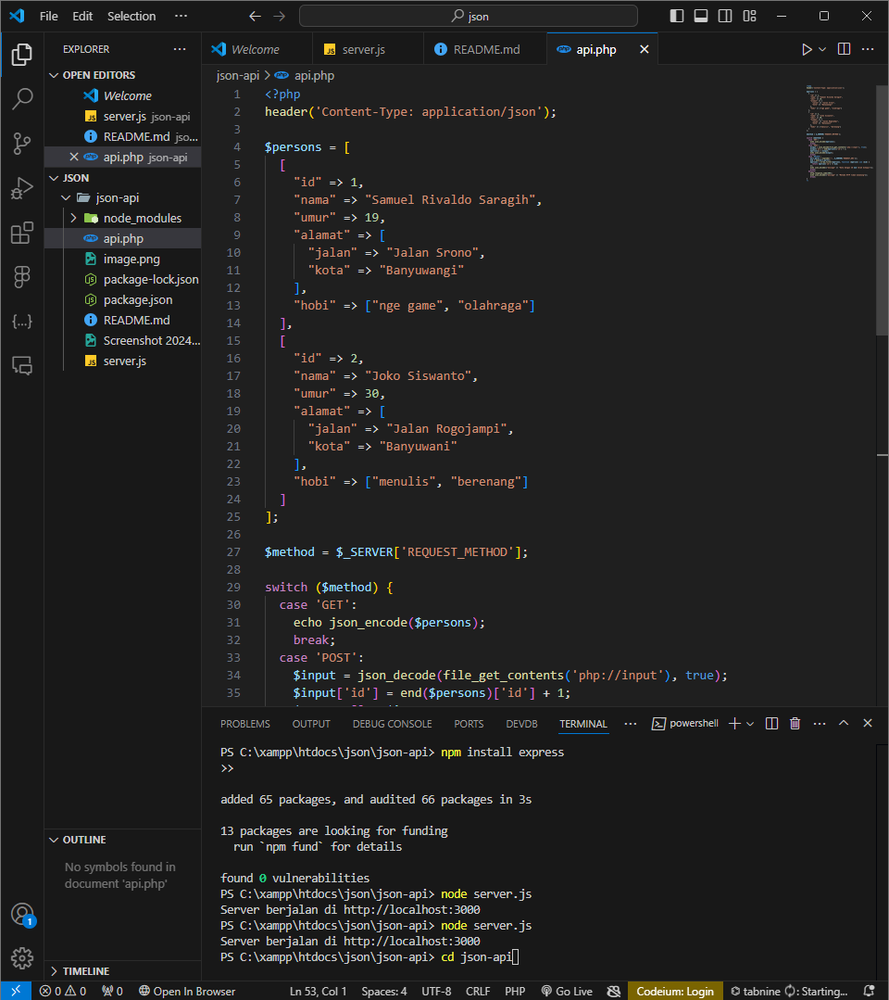
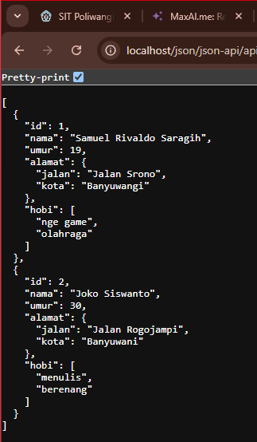
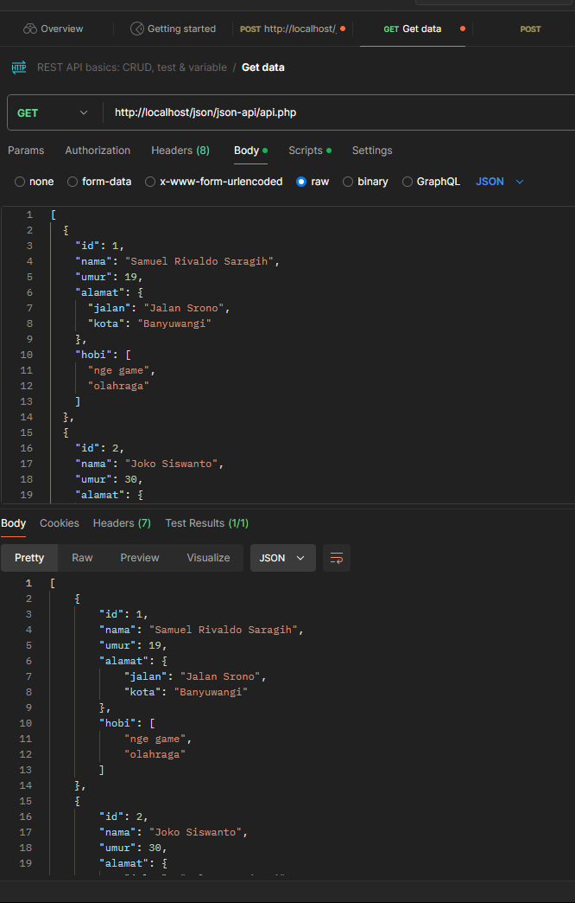
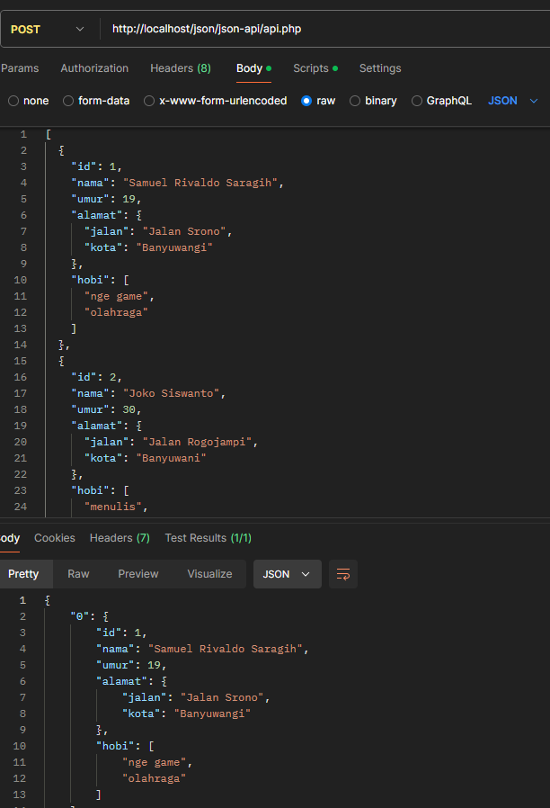
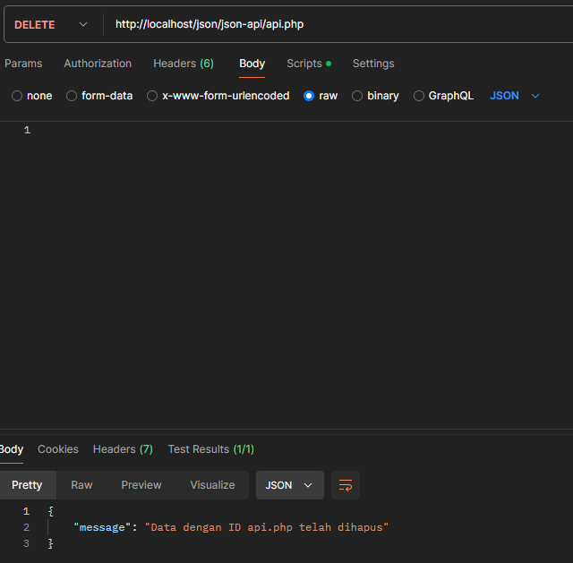
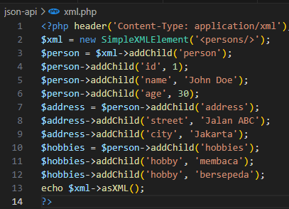
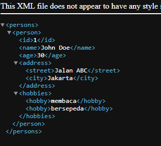
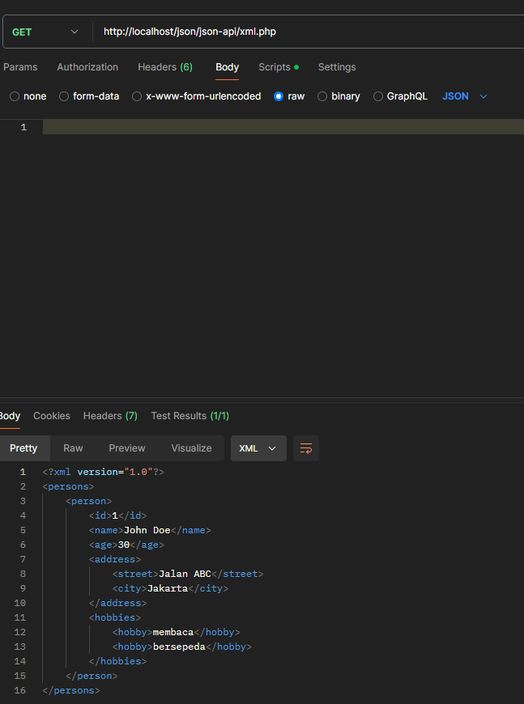

Bagian 1: Membuat API dengan JSON menggunakan Node.js
Langkah 1: Instalasi Node.js dan Express.js

Langkah 2: Membuat Server Express.js

Bagian 2: Membuat API dengan JSON menggunakan PHP

Langkah 3: Membuat File API

Langkah 4: Menjalankan Server

Langkah 5: Mengakses API Gunakan Postman atau curl untuk mengakses API ini

GET

POST

DELETE

Bagian 3: Membuat API dengan XML menggunakan PHP

Langkah 6: Membuat Endpoint XML

Langkah 7: Menjalankan Server

Langkah 8: Mengakses Api
